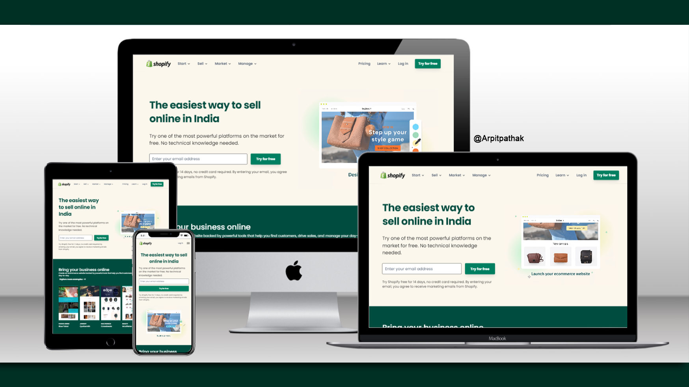

# SHOPIFY Website

## Shopify.in clone 🚀 Website's [Live Link](https://shopifyin.netlify.app/)🔗

>by Arpit Pathak ✨

Website on different devices

Screenshot

## 📌 What I learned from this Project? 📝 

- The project is made entirely with html and tailwind css, so I have learned about tailwind in-depth.
- Learned to make beautiful button with effect on  `:hover` & `:active`
- I have learned how to design Links with resuable code and effects when hovering over them.
- Learned how to use object-fit and object-position properties on images.
- Learned to use position `sticky` to stick navigation bar on top.
- Learned about transalte property to change the position of arrow in links on `:hover`.
- I learned how to make awesome responsive footer section with footer links.
- Learned about `Flexbox` and its properties `justify-content`, `align-items`, `gap`, `flex-wrap` & `flex-direction`.

## 📌 Time taken to finish this project ⏳
- 11 hours

---

